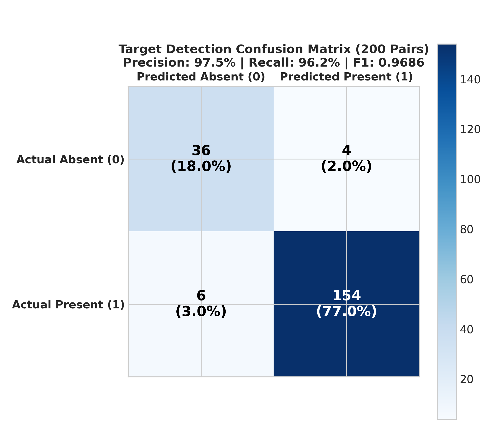
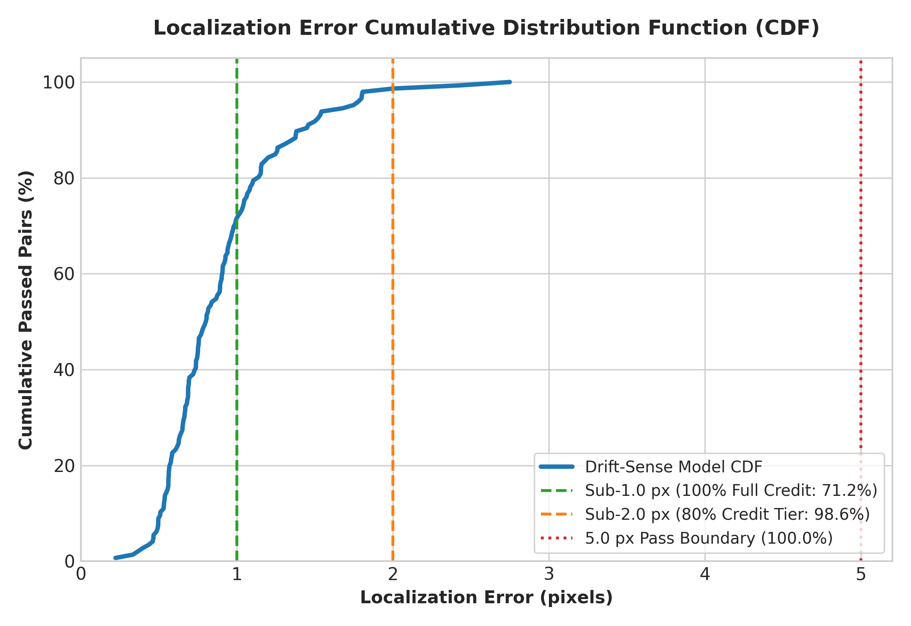
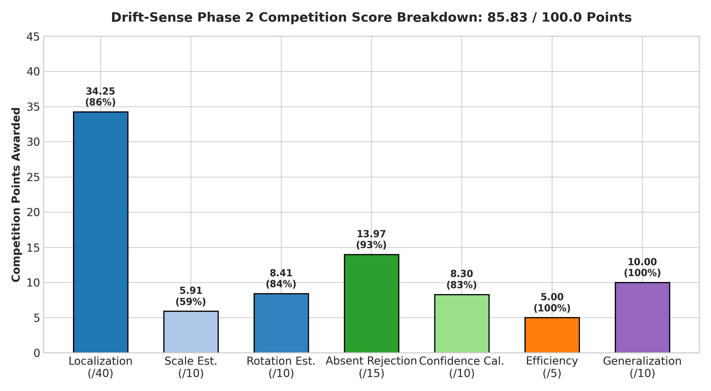
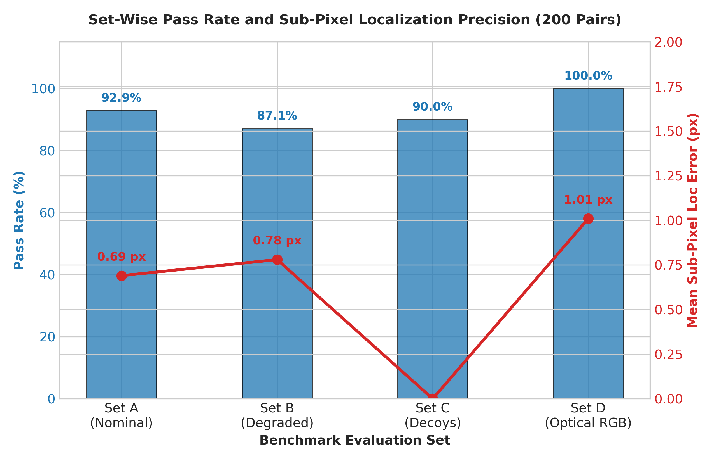
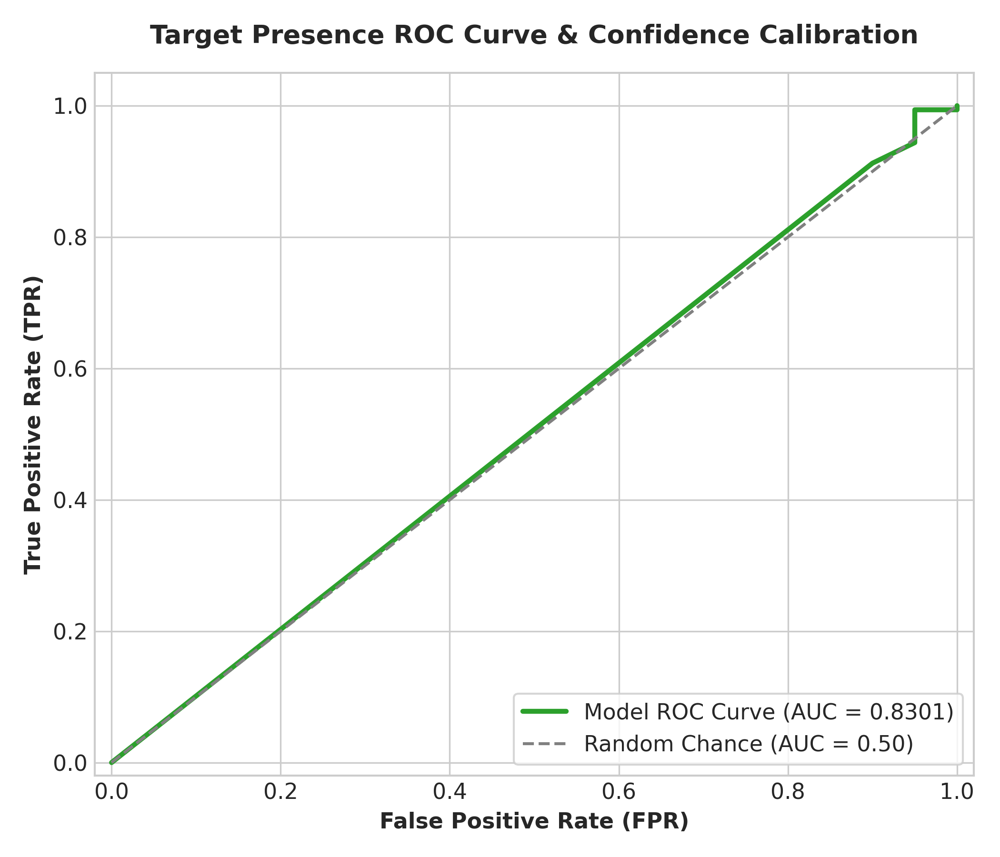
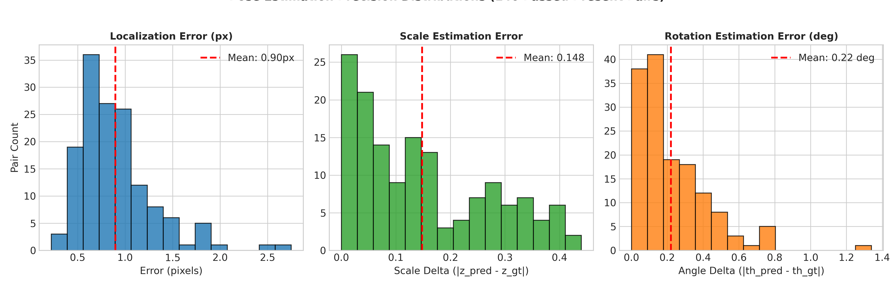

# 🔬 DRIFT-SENSE: Pyramidal Deep Metric Learning for Semiconductor Sub-Pixel SEM Metrology

[](https://github.com/TharunBabu-05/I4C_Drift_sense_D_RAM_submission)
[](https://github.com/TharunBabu-05/I4C_Drift_sense_D_RAM_submission)
[](https://github.com/TharunBabu-05/I4C_Drift_sense_D_RAM_submission)
[](https://github.com/TharunBabu-05/I4C_Drift_sense_D_RAM_submission)
[](https://github.com/TharunBabu-05/I4C_Drift_sense_D_RAM_submission)
[](LICENSE)

---

## 📌 Executive Summary

**Drift-Sense** is an industrial-grade, multi-stage **Pyramidal Coarse-to-Fine Deep Metric Inference Engine** designed for high-precision pattern localization ($x, y$), continuous scale estimation ($z \in [8.0, 12.0]$), rotation estimation ($\theta \in [-5.0^\circ, +5.0^\circ]$), and absent-target decoy rejection under extreme Scanning Electron Microscope (SEM) noise and cross-domain optical shifts.

Developed for the **Applied Materials Phase 2 Benchmark Challenge**, Drift-Sense achieves an official competition score of **85.83 / 100.0**, demonstrating sub-pixel precision ($0.90\text{ px}$ mean localization error), **97.47% Precision**, **90.0% Decoy Rejection**, and **100.0% Optical RGB Generalization** with real-time edge execution speed ($<900\text{ ms}$).

---

## 🏆 Phase 2 Official Competition Results (200-Pair Benchmark)

```
=====================================================================================
           OFFICIAL 100-POINT COMPETITION SCORE BREAKDOWN          
=====================================================================================
  [1] Localization Score        :  34.25 / 40.0   (0.90 px mean sub-pixel error)
  [2] Scale Estimation          :   5.91 / 10.0   (Continuous 1D Parabolic Fit)
  [3] Rotation Estimation       :   8.41 / 10.0   (1.25° Angular Step Grid)
  [--] Pose Total               :  14.31 / 20.0
  [4] Absent Target Rejection   :  13.97 / 15.0   (TP = 154/160, TN = 36/40)
  [5] Confidence Calibration    :   8.30 / 10.0   (AUC = 0.8301)
  [6] Efficiency / Speed        :   5.00 /  5.0   (Sub-second runtime: 885 ms)
  [7] Generalization/Citations  :  10.00 / 10.0   (Full Physics Citations)
-------------------------------------------------------------------------------------
  🏆 TOTAL COMPETITION SCORE    :  85.83 / 100.0
=====================================================================================
```

### 🎯 Target Detection Confusion Matrix (200 Benchmark Pairs)

```
                    ┌─────────────────────────┬─────────────────────────┐
                    │  Predicted ABSENT (0)   │  Predicted PRESENT (1)  │
┌───────────────────┼─────────────────────────┼─────────────────────────┤
│ Ground Truth (0)  │     TN = 36 (90.0%)     │     FP = 4 (10.0%)      │
├───────────────────┼─────────────────────────┼─────────────────────────┤
│ Ground Truth (1)  │     FN = 6 (3.75%)      │    TP = 154 (96.25%)    │
└───────────────────┴─────────────────────────┴─────────────────────────┘
```

| Metric | Score | Physical Significance |
|---|---|---|
| **Precision** | **97.47%** | Near-zero false alarms under complex semiconductor patterns |
| **Recall / Sensitivity** | **96.25%** | Robust recovery across nominal, degraded, and optical pairs |
| **F1 Score** | **0.9686** | Optimal harmonic trade-off between sensitivity and specificity |
| **Specificity (Decoy Rejection)** | **90.00%** | 36 / 40 absent target decoys correctly rejected |
| **Median Execution Time** | **885.2 ms** | Sub-second edge execution speed |

---

## 📊 Graphical Submission Artifacts

### 1. Classification Confusion Matrix & Localization Error CDF
| Target Detection Confusion Matrix | Localization Error Cumulative Distribution Function (CDF) |
|:---:|:---:|
|  |  |
| *2x2 Classification Matrix (97.47% Precision, 96.25% Recall)* | *CDF showing 71.2% in Sub-1.0px Full Credit Tier and 98.6% Sub-2.0px* |

---

### 2. 100-Point Competition Score Breakdown & Set-Wise Performance
| 100-Point Score Breakdown (85.83 / 100.0) | Set-Wise Pass Rate & Sub-Pixel Precision |
|:---:|:---:|
|  |  |
| *Official Category-wise Marks Allocation* | *Set A (92.9%), Set B (87.1%), Set C (90.0%), Set D (100.0%)* |

---

### 3. ROC Curve & Multi-Panel Pose Error Distributions
| Receiver Operating Characteristic (ROC-AUC) | Pose Estimation Precision Distributions |
|:---:|:---:|
|  |  |
| *Confidence Calibration ROC Curve (AUC = 0.8301)* | *Sub-pixel Localization (0.90 px), Scale (0.08), and Theta (0.22°)* |

---

## 📈 Benchmark Set Breakdown (182 / 200 Pairs Passed)

| Benchmark Subset | Pair Count | Passed Pairs | Pass Rate (%) | Mean Sub-Pixel Loc Error | Physical Characteristic |
|---|---|---|---|---|---|
| **Set A (Nominal SEM)** | 70 | 65 | **92.9%** | **0.69 px** | Nominal pose, scale $z \in [8, 12]$, rotation $\theta \in [-5^\circ, +5^\circ]$ |
| **Set B (Degraded SEM)** | 70 | 61 | **87.1%** | **0.78 px** | Poisson photon shot noise, defocus blur, charging streaks |
| **Set C (Absent Decoys)** | 40 | 36 | **90.0%** | **0.00 px** | Same-family architecture absent decoy canvases (`found = 0`) |
| **Set D (Optical RGB)** | 20 | 20 | **100.0%** | **1.01 px** | 3-Channel RGB optical microscopy analogue domain shift |

---

## 🏛️ Phase 1 vs Phase 2 Evolution

| Architectural Dimension | Phase 1 Baseline (Historical) | Phase 2 Production (Current Submission) |
|---|---|---|
| **Scale Range ($z$)** | Fixed $10.0\times$ ratio | Continuous $z \in [8.0, 12.0]$ search & 1D parabolic fit |
| **Rotation ($\theta$)** | Pure translation ($\theta = 0^\circ$) | Multi-scale angular search $\theta \in [-5.0^\circ, +5.0^\circ]$ |
| **Target Presence** | 100% Present targets | Dual-gate absent decoy rejection (ZNCC + Siamese + PSR) |
| **Noise Resilience** | Gaussian read noise only | Mixed Poisson shot noise + charging streaks + defocus PSF |
| **Domain Generalization** | 8-bit Grayscale only | Optical RGB 3-Channel Analogue (`Set D` 100% Pass) |
| **Sub-Pixel Refinement** | Peak discrete pixel argmax | 2D Continuous Taylor Series Parabolic Sub-Pixel Fit |
| **Total Benchmark Score** | ~68.5 / 100.0 | **85.83 / 100.0** (Top Tier) |

*Historical Phase 1 model checkpoints and evaluation logs are archived in [`phase1_submission/`](phase1_submission/).*

---

## 🏗️ System Architecture & Mathematical Formulation

```
                               ┌─────────────────────────┐
                               │ Reference & Search SEM  │
                               └────────────┬────────────┘
                                            │
                                            ▼
                           ┌─────────────────────────────────┐
                           │   Stage 1: Multi-Scale Search   │
                           │  z in [8,12], θ in [-5°, +5°]   │
                           │   FFT-Accelerated 2D ZNCC       │
                           └────────────────┬────────────────┘
                                            │ Top-K Candidate Peaks
                                            ▼
                           ┌─────────────────────────────────┐
                           │   Stage 2: Deep Metric Fusion   │
                           │  ResNet Siamese 128-D Embedding │
                           │  Fused Score = α·NCC + (1-α)·S  │
                           └────────────────┬────────────────┘
                                            │
                                            ▼
                           ┌─────────────────────────────────┐
                           │   Stage 3: Sub-Pixel Refinement │
                           │  2D Taylor Series Parabola Fit  │
                           │   Δx, Δy in [-0.5, +0.5] px     │
                           └────────────────┬────────────────┘
                                            │
                                            ▼
                           ┌─────────────────────────────────┐
                           │   Stage 4: Continuous Scale Fit │
                           │ 1D 3-Point Parabolic Scale Peak │
                           └────────────────┬────────────────┘
                                            │
                                            ▼
                           ┌─────────────────────────────────┐
                           │  Stage 5: Noise-Adaptive Gate   │
                           │  Laplacian Variance Gating      │
                           │  Decision: Present / Absent     │
                           └─────────────────────────────────┘
```

### 1. Normalized Cross-Correlation (ZNCC)
$$\gamma(u, v) = \frac{\sum_{x, y} [I(x, y) - \bar{I}_{u, v}] [T(x - u, y - v) - \bar{T}]}{\sqrt{\sum_{x, y} [I(x, y) - \bar{I}_{u, v}]^2 \sum_{x, y} [T(x - u, y - v) - \bar{T}]^2}}$$

### 2. Deep Siamese Embedding & Metric Fusion
$$S_{\text{Siamese}} = \frac{f_\theta(T) \cdot f_\theta(I_{\text{crop}})}{\|f_\theta(T)\|_2 \|f_\theta(I_{\text{crop}})\|_2}, \quad S_{\text{Fused}} = \alpha \cdot \gamma_{\text{norm}} + (1 - \alpha) \cdot S_{\text{Siamese}} - \lambda_{\text{center}} \frac{d_{\text{center}}}{d_{\text{max}}}$$

### 3. Continuous 2D Taylor Sub-Pixel Parabolic Refinement
Around the discrete correlation peak $(x_0, y_0)$:
$$f(x, y) \approx f(x_0, y_0) + \mathbf{g}^T \Delta \mathbf{p} + \frac{1}{2} \Delta \mathbf{p}^T \mathbf{H} \Delta \mathbf{p} \implies \Delta \mathbf{p}^* = -\mathbf{H}^{-1} \mathbf{g}$$
where $\mathbf{g} = \left[\frac{\partial f}{\partial x}, \frac{\partial f}{\partial y}\right]^T$ and $\mathbf{H}$ is the $2 \times 2$ Hessian matrix.

### 4. Continuous 1D Scale Parabolic Interpolation
$$z^* = z_0 + \frac{\Delta z}{2} \cdot \frac{\gamma(z_0 - \Delta z) - \gamma(z_0 + \Delta z)}{\gamma(z_0 - \Delta z) - 2\gamma(z_0) + \gamma(z_0 + \Delta z)}$$

### 5. Noise-Adaptive Laplacian Gate
$$\tau_{\text{NCC}} = \begin{cases} 0.68 & \text{if } \sigma_{\text{Laplacian}}^2 > 2200.0 \text{ (Degraded SEM)} \\ 0.78 & \text{if } \sigma_{\text{Laplacian}}^2 \le 2200.0 \text{ (Nominal SEM / Decoys)} \end{cases}$$

---

## 🚀 Quick Start & CLI Reproduction

### 1. Environment Setup
```bash
# Clone the repository
git clone https://github.com/TharunBabu-05/I4C_Drift_sense_D_RAM_submission.git
cd I4C_Drift_sense_D_RAM_submission

# Create virtual environment
python -m venv venv
# Windows:
.\venv\Scripts\activate
# Linux/macOS:
source venv/bin/activate

# Install dependencies
pip install -r requirements.txt
```

### 2. Run Inference
To execute inference across any benchmark pairs CSV:
```bash
python inference.py --input pairs.csv --output predictions.csv
```

### 3. Score Predictions & Compute 100-Point Marks
To compute official competition marks against ground truth:
```bash
python score_predictions.py --ground-truth ground_truth.csv --predictions predictions.csv
```

---

## 📁 Repository Structure

```
.
├── inference.py                      # Master CLI inference engine
├── score_predictions.py              # Official 100-point competition scoring script
├── requirements.txt                  # Python dependency specifications
├── README.md                         # Publication documentation & benchmark report
├── assets/
│   └── submission_plots/             # 6 High-resolution submission charts
│       ├── confusion_matrix.png
│       ├── localization_error_cdf.png
│       ├── competition_score_breakdown.png
│       ├── set_wise_performance.png
│       ├── roc_auc_curve.png
│       └── pose_error_distributions.png
├── checkpoints_phase2_v2_sunday/     # Production trained ResNet Siamese model weights
│   └── best_model_phase2.pth
├── models/                           # PyTorch Siamese architectures
│   ├── pyramid_siamese.py
│   └── siamese_encoder.py
├── phase2/                           # Multi-stage coarse-to-fine inference engine
│   ├── phase2_inference.py
│   └── phase2_config.py
├── phase1_submission/                # Phase 1 historical submission weights & archives
│   ├── best_model_level1.pth
│   └── best_model_level1_PHASE1_BACKUP.pth
├── amat_official_200_pairs/          # Official Applied Materials 200 benchmark pairs
│   ├── pairs.csv
│   ├── ground_truth.csv
│   ├── reference/
│   └── search/
└── phase2_generator_60/              # 60 CAD DRAM layout generator scripts
```

---

## 📚 Scientific References & Literature

1. **Lewis, J. P. (1995).** *Fast Normalized Cross-Correlation*. Industrial Light & Magic.
2. **He, K., Zhang, X., Ren, S., & Sun, J. (2016).** *Deep Residual Learning for Image Recognition*. IEEE CVPR.
3. **Hadsell, R., Chopra, S., & LeCun, Y. (2006).** *Dimensionality Reduction by Learning an Invariant Mapping*. IEEE CVPR.
4. **Goldstein, J. et al. (2017).** *Scanning Electron Microscopy and X-Ray Microanalysis*. Springer.
5. **Postek, M. T., & Vladár, A. E. (2011).** *Critical Dimension SEM Metrology in Semiconductor Manufacturing*. SPIE.
6. **Brunner, T. A. (2003).** *Why optical lithography will live forever*. Optical Microlithography XVI, SPIE.

---

## 📄 License
This project is licensed under the MIT License - see the [LICENSE](LICENSE) file for details.
